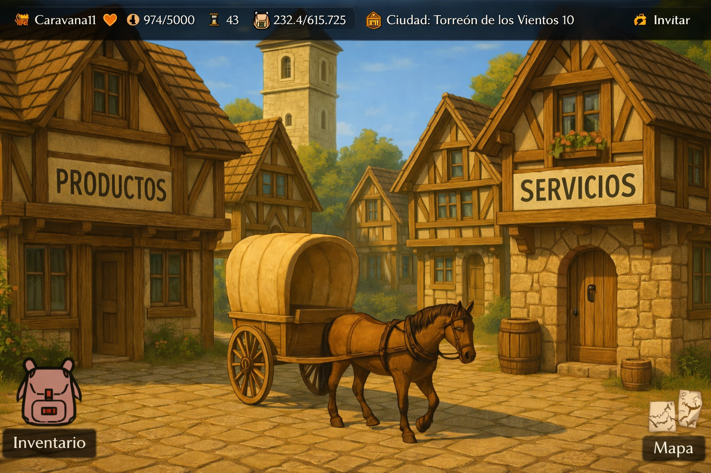
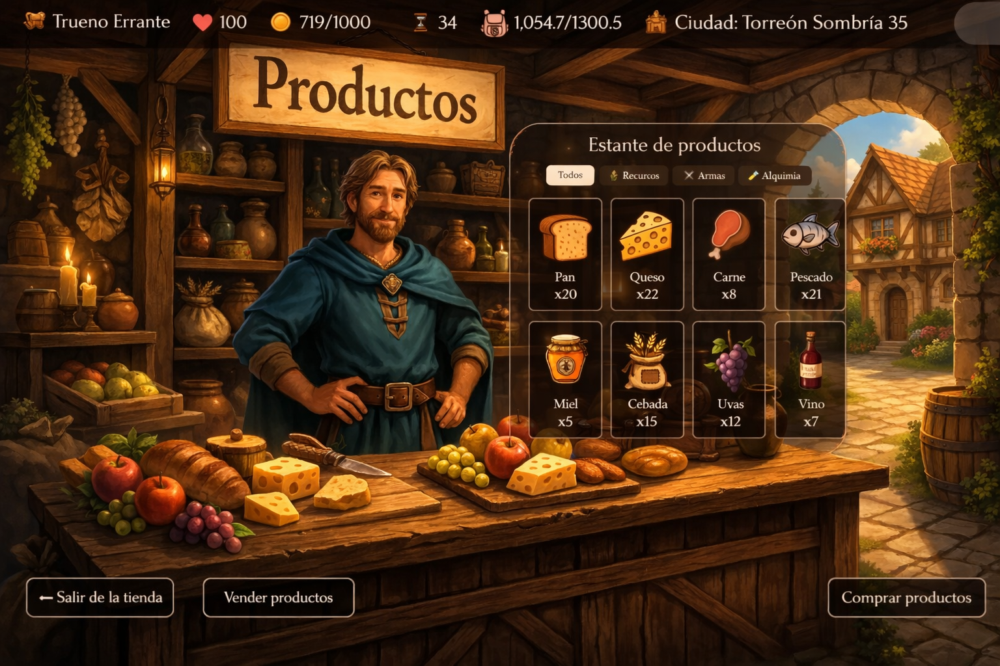
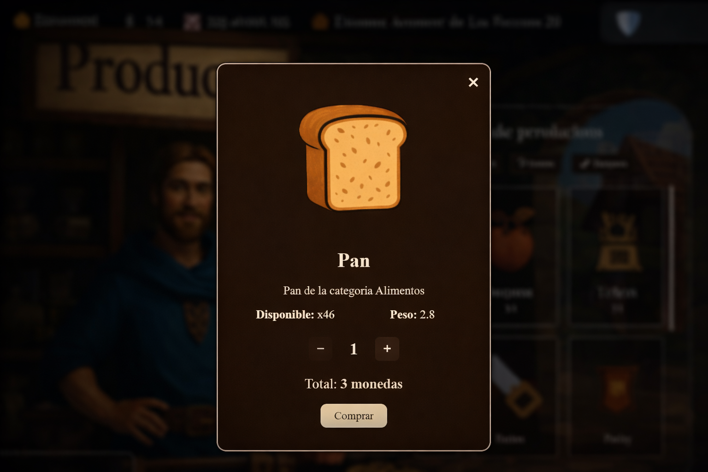
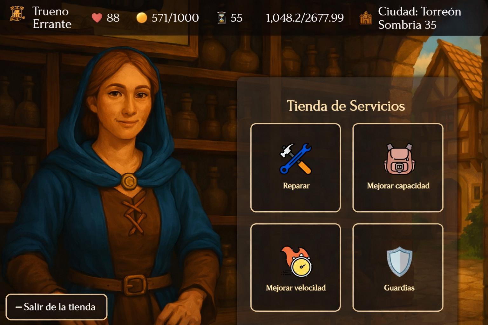
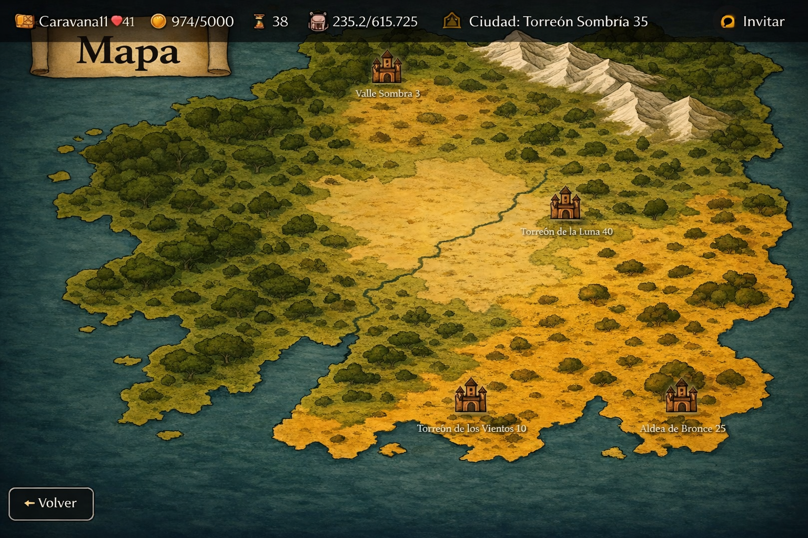
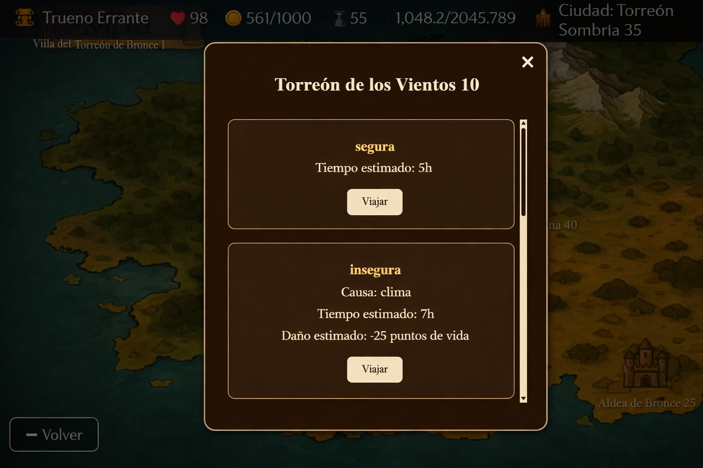

# Caravana Medieval

A multiplayer strategy and trading web application where players manage a caravan to maximize profits (Gold Coins) within a configurable time limit. The system implements a **supply-and-demand economy**, a **route-based map with risk/reward travel**, and **role-based access control** for different player types.

## Table of Contents

- [Project Purpose](#project-purpose)
- [Architecture and Design Patterns](#architecture-and-design-patterns)
- [Key Algorithms and Logic](#key-algorithms-and-logic)
- [Database Schema](#database-schema)
- [Tech Stack](#tech-stack)
- [Project Structure](#project-structure)
- [Setup and Installation](#setup-and-installation)
- [Proof of Concept](#proof-of-concept)

---

## Project Purpose

The application models a medieval trading simulation composed of the following domain elements:

- **Caravans** — entities with attributes for `speed`, `maxCapacity`, `availableMoney`, `lifePoints`, and a reference to a `currentCity`. They transport products between cities.
- **Cities** — nodes in a graph-based map. Each city charges an `entryTax` and maintains its own product inventory with individual supply/demand factors.
- **Routes** — directed edges between cities. Each route has a `type` (safe or unsafe), a `travelTime`, and optional `damage` and `damageCause` fields. Unsafe routes deal damage to the caravan but offer shorter travel times.
- **Products** — tradeable items with `name`, `weight`, and `description`. Their price is computed dynamically based on city-level stock (see [Key Algorithms](#key-algorithms-and-logic)).
- **Services** — permanent or stackable upgrades purchasable in cities: Repair (restore HP), Upgrade Capacity (up to 400% max), Upgrade Speed (up to 50% max), and Guards (25% damage reduction on unsafe routes).
- **Games** — sessions that bind a caravan to a map with `elapsedTime`, `timeLimit`, and `minProfit` thresholds.
- **Players** — authenticated users assigned a role (`COMERCIANTE` or `CARAVANERO`) that determines their permissions.

The backend exposes a RESTful API secured with JSON Web Tokens (JWT). The frontend is a Single-Page Application (SPA) that consumes these endpoints through Angular services.

---

## Architecture and Design Patterns

### Layered Architecture

The backend follows a standard three-tier architecture:

```
Controller → Service (interface) → ServiceImpl → Repository → Database
```

| Layer | Package | Responsibility |
|---|---|---|
| **REST Controllers** | `controller/` | 17 controllers mapping HTTP endpoints. Each delegates to a corresponding service. Role-based endpoint protection is enforced via `@PreAuthorize`. |
| **Service Layer** | `service/` | 25 classes (interfaces + implementations). Contains all business logic, including trading formulas, travel validation, and invite code generation. |
| **Repository Layer** | `repository/` | 14 Spring Data JPA repository interfaces. Uses derived query methods and composite key lookups. |
| **Model / Entity Layer** | `model/` | 15 JPA entities with 5 composite key classes in `model/keys/`. Entities use Spanish-named database columns mapped to English-named Java fields. |
| **DTO Layer** | `dto/` | 25 Data Transfer Objects used to decouple API payloads from persistence entities. |
| **Mapper Layer** | `mapper/` | MapStruct-based mappers for automatic entity-DTO conversion at compile time. |


### Frontend Architecture

The Angular 19 SPA uses a **feature-module** structure:

- **`core/`** — Singleton services (`auth.service.ts`, `caravan.service.ts`, etc.), the `AuthGuard`, and the `auth.interceptor.ts`.
- **`features/`** — 12 standalone feature components: `login`, `register`, `select-map`, `select-game`, `select-caravan`, `select-difficulty`, `select-role`, `map`, `inventory`, `store-products`, `store-services`, `resume`.
- **`shared/`** — Reusable UI components (`game-status-bar`, `inventory-panel`, `product-popup`, `service-popup`, `active-services-bar`) and shared data models.

Routing is defined in `app.routes.ts` with public routes (`/login`, `/register`) and protected routes guarded by `AuthGuard`.

---

## Key Algorithms and Logic

### Dynamic Pricing (Supply and Demand)

Located in: [`StoreService.java`](backend/src/main/java/web/app/caravanamedieval/service/StoreService.java)

The trading system implements two pricing formulas using per-city `supplyFactor` and `demandFactor` values stored in the `ProductsByCity` join entity:

**Buying price** (player purchasing from a city):

```
unitPrice = supplyFactor / (1 + currentStock)
```

Implemented in `calculateTotalPrice()`:
```java
double unitPrice = cityProduct.getSupplyFactor() / (1 + stock);
return Math.round(unitPrice * quantity);
```

**Selling price** (player selling to a city):

```
unitPrice = demandFactor / (1 + currentStock)
```

Implemented in `sellProduct()` and `getProductsForSale()`:
```java
unitPrice = Math.round((double) cityProduct.getDemandFactor() / (1 + stock));
```

As stock increases, prices decrease. As stock decreases (or falls to zero), prices increase. When a product does not yet exist in a city's inventory, a default factor of `100` is applied.

The buy transaction deducts gold from the caravan and reduces city stock. The sell transaction adds gold to the caravan and increases city stock. If the city stock reaches zero after a purchase, the `ProductsByCity` record is deleted.

### Travel System

Located in: [`TravelService.java`](backend/src/main/java/web/app/caravanamedieval/service/TravelService.java)

The `travel()` method performs the following transactional operations:

1. **Health Validation** — Ensures `caravan.lifePoints > route.damage`. If not, the travel is rejected.
2. **Time Validation** — Ensures `(game.timeLimit - game.elapsedTime) >= route.travelTime`.
3. **Damage Calculation** — If the caravan has the "Guardias" (Guards) service active, route damage is reduced by 25%:
   ```java
   int reduction = Math.round(routeDamage * 0.25f);
   routeDamage -= reduction;
   ```
4. **Travel Time Calculation** — If the "Mejorar velocidad" (Upgrade Speed) service is purchased, travel time is reduced proportionally:
   ```java
   float totalReduction = improvementPerPurchase * currentUpgrade;
   int reducedTime = Math.round(baseTravelTime * (1 - totalReduction));
   return Math.max(reducedTime, 1); // minimum 1 unit
   ```
5. **State Mutation** — The caravan's HP is reduced, elapsed time is incremented, and `currentCity` is updated to the route's destination.

### Invite Code System (Multiplayer)

Located in: [`InviteCodeService.java`](backend/src/main/java/web/app/caravanamedieval/service/InviteCodeService.java)

Players can join existing games using invite codes:

- Codes are **15-character alphanumeric strings** generated randomly.
- Each code has a **30-minute expiration** (`LocalDateTime.now().plusMinutes(30)`).
- The `generateOrReuseCode()` method checks for an existing non-expired code before generating a new one.
- Validation verifies the code exists and has not expired, then returns the associated game ID.

### Data Seeding

Located in: [`DataInitializer.java`](backend/src/main/java/web/app/caravanamedieval/init/DataInitializer.java)

The `DataInitializer` class implements `CommandLineRunner` and contains methods to pre-populate the database. **Currently, all method calls in `run()` are commented out**, but the seeding logic is preserved for:

- **3 Maps** with descriptive names and descriptions.
- **100 Cities** randomly assigned to maps with random entry taxes.
- **Random Routes** between cities (safe/unsafe types, damage values, travel times).
- **30 Caravans** with randomized speed (20–50), capacity (500–1500), money (1000–6000), and HP (20–100).
- **50 Products** drawn from 10 base types (Sword, Shield, Potion, Armor, Ring, Bow, Dagger, Staff, Helmet, Boots).
- **4 Services** — Repair (10% per purchase, max 50%), Upgrade Capacity (10% per purchase, max 400%), Upgrade Speed (10% per purchase, max 50%), Guards (10% per purchase, max 50%).

---

## Database Schema

The application uses 15 JPA entities mapped to PostgreSQL tables. The entity-relationship model uses Spanish table and column names:

### Core Entities

| Entity | Table | Key Fields |
|---|---|---|
| `Map` | `mapa` | `id_mapa`, `nombre`, `descripcion`, `img_url` |
| `City` | `ciudad` | `id_ciudad`, `nombre`, `impuesto_entrada`, `mapa_id`, `img_url` |
| `Route` | `ruta` | `id_ruta`, `tipo`, `ciudad_origen_id`, `ciudad_destino_id`, `dano`, `causa_dano`, `tiempo_trayecto` |
| `Caravan` | `caravana` | `id_caravana`, `nombre`, `velocidad`, `capacidad_maxima`, `dinero_disponible`, `puntos_vida`, `ciudad_actual_id`, `img_url` |
| `Product` | `producto` | `id_producto`, `nombre`, `descripcion`, `peso`, `img_url` |
| `Services` | `servicio` | `id_servicio`, `nombre`, `descripcion`, `mejora_por_compra`, `mejora_max`, `img_url` |
| `Game` | `partida` | `id_partida`, `tiempo_transcurrido`, `tiempo_limite`, `ganancia_minima`, `caravana_id`, `mapa_id` |
| `Player` | `jugador` | `id_jugador`, `username`, `password`, `rol`, `img_url` |
| `InviteCode` | `codigo_invitacion` | `id_codigo`, `codigo`, `partida_id`, `creado_en`, `expira_en` |

### Join / Associative Entities (Composite Keys)

| Entity | Table | Composite Key | Extra Columns |
|---|---|---|---|
| `ProductsByCity` | `productosxciudad` | `(ciudad_id, producto_id)` | `cantidad`, `factor_oferta`, `factor_demanda` |
| `ProductsByCaravan` | `productosxcaravana` | `(caravana_id, producto_id)` | `cantidad` |
| `ServicesByCity` | `serviciosxciudad` | `(ciudad_id, servicio_id)` | `precio`, `comprado` |
| `ServicesByCaravan` | `serviciosxcaravana` | `(caravana_id, servicio_id)` | `mejora_actual` |
| `GamesByPlayer` | `partidasxjugador` | `(partida_id, jugador_id)` | — |


---

## Tech Stack

### Backend

| Technology | Version | Purpose |
|---|---|---|
| Java | 21 | Primary language |
| Spring Boot | 3.4.3 | Application framework |
| Spring Data JPA | (managed) | ORM and repository abstraction |
| Spring Security | (managed) | Authentication and authorization |
| jjwt (io.jsonwebtoken) | 0.11.5 | JWT token generation and validation (HMAC-SHA256) |
| MapStruct | 1.5.5.Final | Compile-time DTO ↔ entity mapping |
| Lombok | 1.18.36 | Boilerplate reduction (`@Data`, `@Getter`, `@Setter`) |
| PostgreSQL | 42.7.3 (driver) | Production database |
| H2 Database | (managed) | In-memory database for testing |
| Apache Commons Lang | 3.12.0 | Utility functions |
| Maven | (wrapper) | Build and dependency management |

### Frontend

| Technology | Version | Purpose |
|---|---|---|
| Angular | 19.2.0 | SPA framework |
| TypeScript | 5.7.2 | Primary language |
| RxJS | 7.8.0 | Reactive programming for HTTP calls |
| jwt-decode | 4.0.0 | Client-side JWT token decoding |
| SCSS | — | Component styling |
| Zone.js | 0.15.0 | Angular change detection |


---

### Role-Based Access Control

Access to API endpoints is enforced using `@PreAuthorize` annotations at the controller level:

| Endpoint | Allowed Roles |
|---|---|
| `POST /api/auth/signup` | Public (no authentication) |
| `POST /api/auth/login` | Public (no authentication) |
| `POST /api/store/buy` |  `COMERCIANTE` only |
| `POST /api/store/sell` |  `COMERCIANTE` only|
| `GET /api/store/products-for-sale/...` | `CARAVANERO`, `COMERCIANTE` |
| `POST /api/travel` | `CARAVANERO` only |
| All other `/api/**` endpoints | Authenticated (any role) |

---

## Setup and Installation

### Prerequisites

- **Java 21** (JDK)
- **Node.js** (LTS recommended) and **npm**
- **PostgreSQL** instance (or H2 for local testing)
- **Maven** (or use the included `mvnw` wrapper)

### Backend

1. Clone the repository:
   ```bash
   git clone https://github.com/juliancramos/caravana-medieval.git
   cd caravana-medieval
   ```

2. Configure database credentials via environment variables:
   ```bash
   export spring_datasource_url=url
   export spring_datasource_username=username
   export spring_datasource_password=password
   ```

3. Build and run the backend:
   ```bash
   ./mvnw spring-boot:run
   ```
   The API will be available at `http://localhost:8080/api/`.

### Frontend

1. Navigate to the frontend directory:
   ```bash
   cd frontend
   ```

2. Install dependencies:
   ```bash
   npm install
   ```

3. Start the development server with the API proxy:
   ```bash
   ng serve --proxy-config proxy.conf.json
   ```
   The SPA will be available at `http://localhost:4200/`. The proxy configuration forwards all `/api` requests to `http://localhost:8080`.

---

## Proof of Concept

Visual demonstration of the complete user journey.

<table>
  <tr>
    <td align="center" width="50%">
      
      <br>
      <sub><b>1. Authentication</b><br>Login screen with username/password fields.</sub>
    </td>
    <td align="center" width="50%">
      
      <br>
      <sub><b>2. Game Selection</b><br>Lobby view showing existing games and options to create or join a session.</sub>
    </td>
  </tr>

  <tr>
    <td align="center" width="50%">
      
      <br>
      <sub><b>3. City Hub</b><br>Main game view with caravan stats bar, Products and Services stores, Inventory and Map access.</sub>
    </td>
    <td align="center" width="50%">
      
      <br>
      <sub><b>4. Products Store</b><br>City marketplace displaying available goods with stock quantities and category filters.</sub>
    </td>
  </tr>

  <tr>
    <td align="center" width="50%">
      
      <br>
      <sub><b>5. Dynamic Pricing</b><br>Product detail popup showing computed price based on supply/demand formula, quantity selector, and weight.</sub>
    </td>
    <td align="center" width="50%">
      
      <br>
      <sub><b>6. Services Store</b><br>Four available services: Repair, Upgrade Capacity, Upgrade Speed, and Guards.</sub>
    </td>
  </tr>

  <tr>
    <td align="center" width="50%">
      
      <br>
      <sub><b>7. Map Navigation</b><br>Interactive map showing connected cities with names.</sub>
    </td>
    <td align="center" width="50%">
      
      <br>
      <sub><b>8. Route Selection</b><br>Travel dialog displaying safe vs. unsafe routes with estimated time, damage, and cause.</sub>
    </td>
  </tr>

  <tr>
    <td colspan="2" align="center">
      
      <br>
      <sub><b>9. Multiplayer Invite</b><br>Generated 15-character alphanumeric code with 30-minute expiration for other players to join the session.</sub>
    </td>
  </tr>
</table>


## Development Team

| Member              | GitHub Profile | Role       |
|:------------------:|:--------------:|:----------:|
| Julian Ramos        | [@juliancramos](https://github.com/juliancramos)  | Development|
| Juan Rozo       | [@JuanR771](https://github.com/JuanR771)    | Development|

